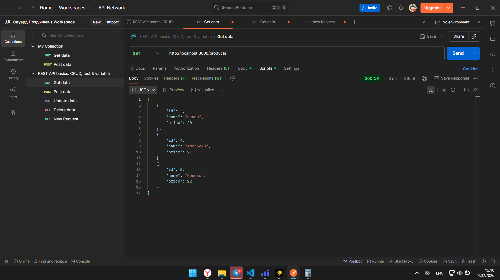
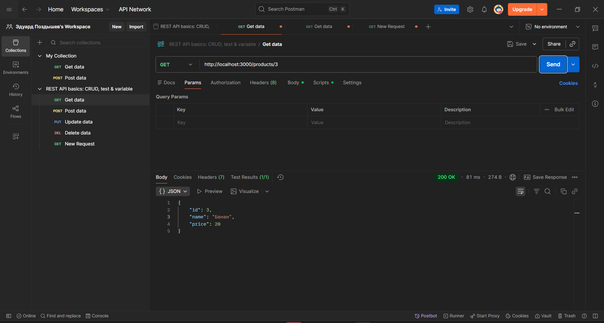
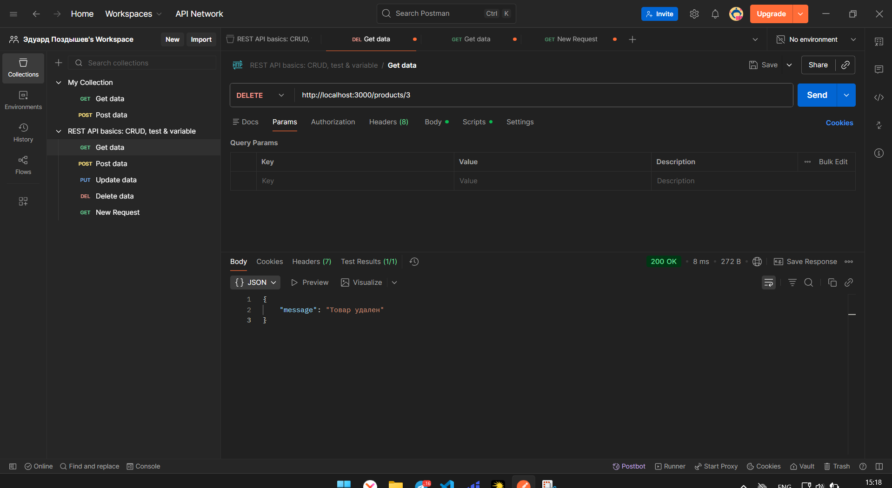
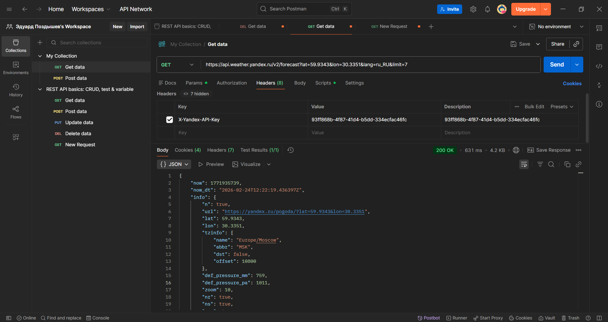
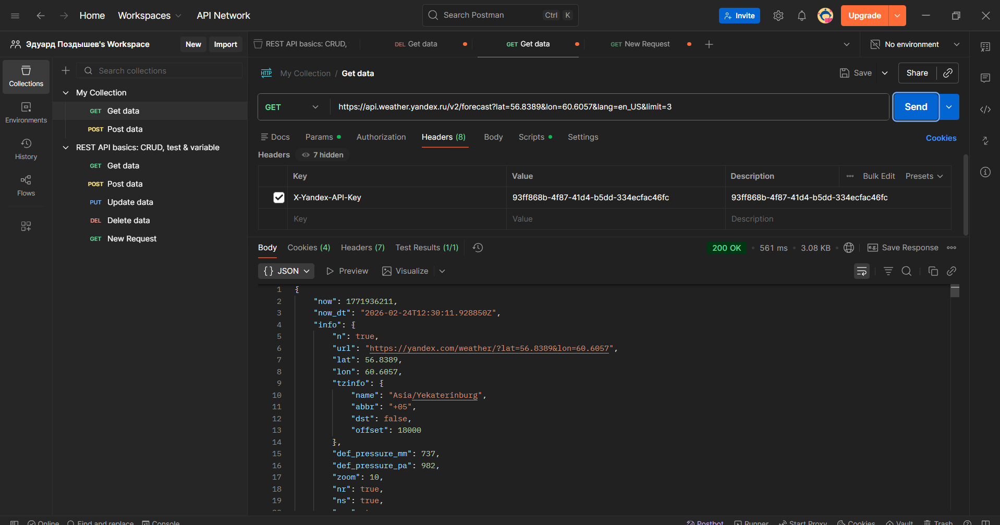
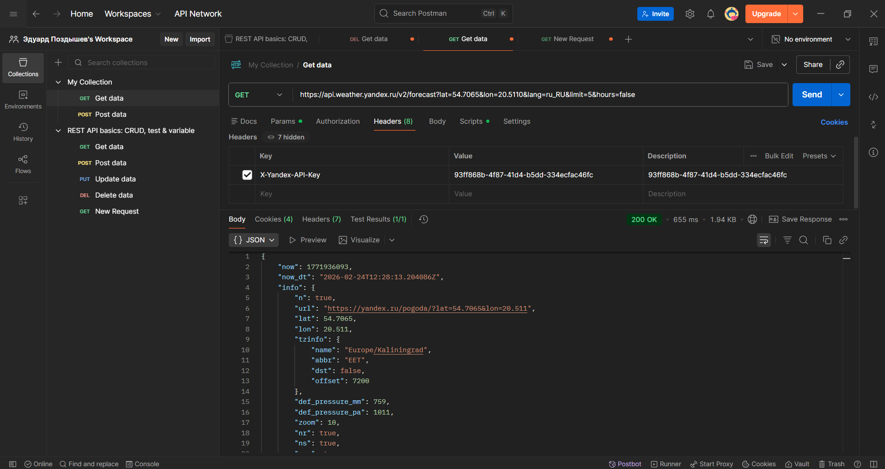
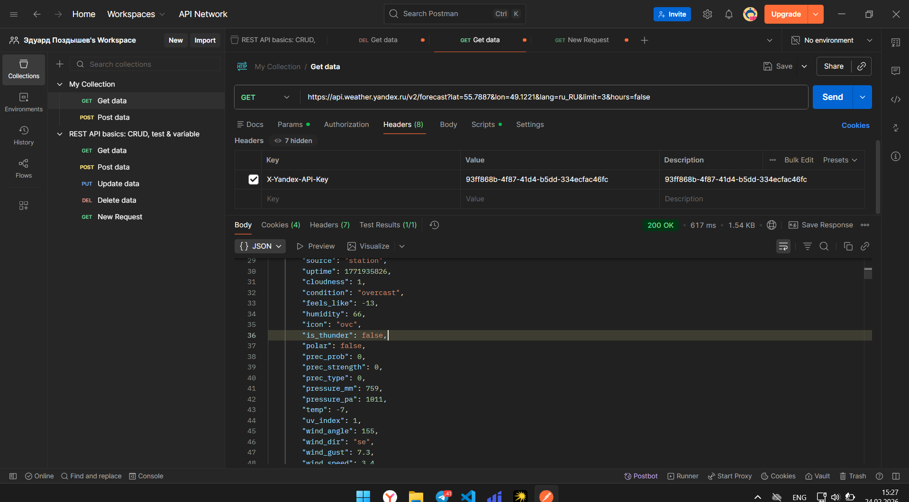
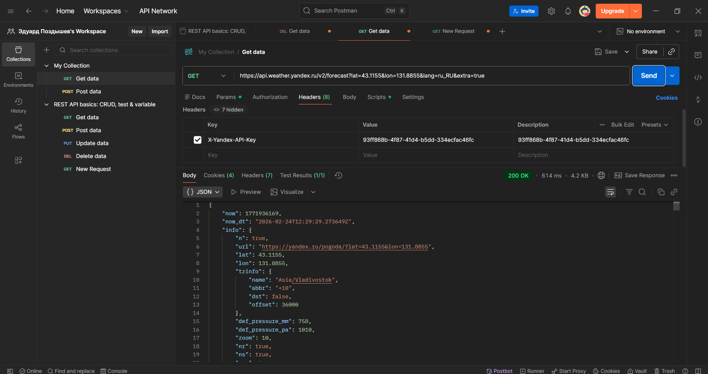

Протестируйте ваш реалиованный API из Практического занятия 2 с помощью
Postman (не менее 3-х запросов).

1. ```http://localhost:3000/products/```
   

2. ```http://localhost:3000/products/3```
   

3. ```http://localhost:3000/products/3```
   

Выберите API (пример, Открытые API) и получите ключ. Изучите документацию и
выполните не менее 5-ти запросов.

1. 
2. 
3. 
4. 
5. 
   
   